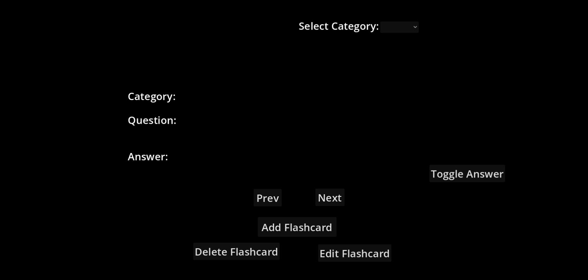
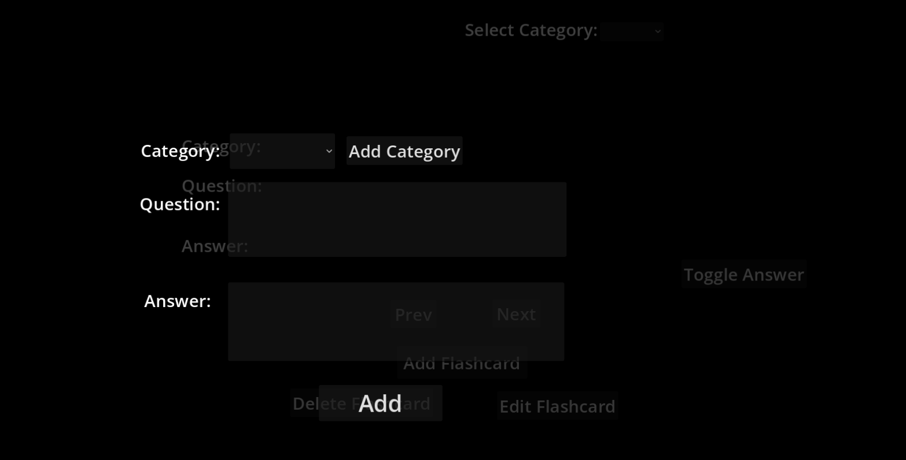
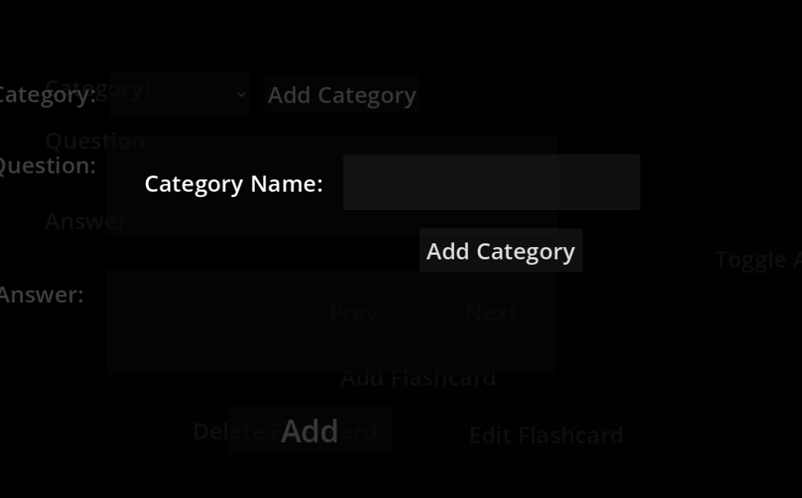

# 📚 Smart Flashcard Quiz App

A simple and lightweight flashcard application built with **Godot 4.6 (.NET)** and **C#**. The app helps students organize study material into categories and review flashcards efficiently.

---

## ✨ Features

- ➕ Add new flashcards
- ✏️ Edit existing flashcards
- 🗑️ Delete flashcards
- 📂 Organize flashcards into categories
- 🔍 Filter flashcards by category
- 👁️ Show/Hide answer toggle
- ⏮️ Previous / Next navigation
- 💾 Automatic JSON save & load
- ✅ Input validation for empty fields and duplicate categories

---

## 🎯 Design Philosophy

This project follows a **minimalist and lightweight** design philosophy.

Instead of focusing on excessive visual effects or unnecessary complexity, the application prioritizes clarity, usability, and responsiveness. Every feature included serves a practical purpose, allowing users to focus on their task without distractions.

The lightweight architecture also keeps the application accessible across a wide range of hardware, making it suitable for both modern and older systems while maintaining a smooth user experience.

**Core principles:**
- 🎯 Simple and intuitive user interface
- ⚡ Lightweight and responsive
- 🧩 Focused on essential functionality
- 📖 Easy to learn and easy to use
- 🌍 Designed to be accessible on a wide range of devices

---

## 🛠️ Built With

- **Godot Engine 4.6 (.NET)**
- **C#**
- **System.Text.Json** for data serialization

---

## 📂 Data Storage

The application stores data locally using JSON files.

- `flashcards.json` – Stores all flashcards.
- `categories.json` – Stores available categories.

Data is automatically saved and loaded between sessions.

---

## 📸 Screenshots

### Home Screen

### Add Flashcard

### Add Category

---

## 🚀 How to Run

>Follow 
1. Clone this repository.
2. Open the project in **Godot 4.6 (.NET)**.
3. Build the C# project.
4. Run the project.

---

## 📋 Project Requirements Implemented

✔ Add Flashcards

✔ Edit Flashcards

✔ Delete Flashcards

✔ Categorize Flashcards

✔ Category Filtering

✔ Show Answer Toggle

✔ Previous / Next Navigation

✔ Local JSON Data Storage

---

## 📄 License

This project was developed as part of the **InternGrow App Development Internship** for educational purposes.
